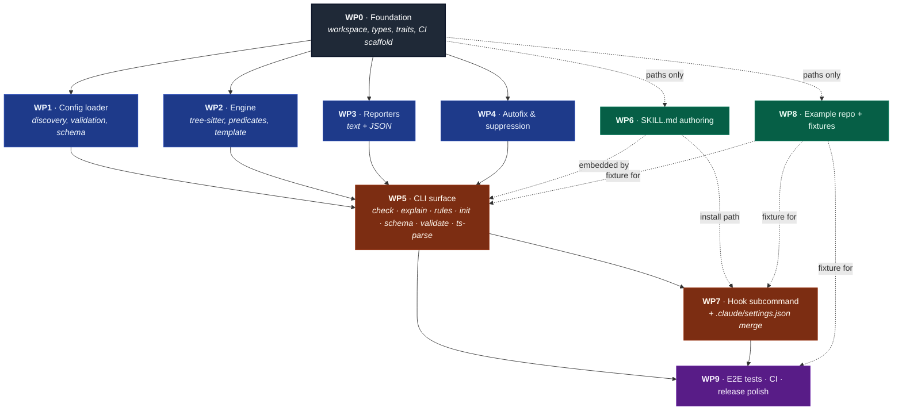

# lintropy — sub-agent work packages

**Date:** 2026-04-18
**Source spec:** [`specs/merged/2026-04-18-lintropy-merged.md`](./2026-04-18-lintropy-merged.md)
**Scope:** Phase 1 (MVP) only. Phase 2/3 items are explicitly out of scope.

This document slices the MVP into nine work packages (WPs) that can be
dispatched to parallel sub-agents. Each WP names its inputs, outputs, the
files it owns (write authority), the files it consumes (read-only contract),
and ships a self-contained kick-off prompt that can be copy-pasted into a
sub-agent invocation.

---

## Dependency graph



**Legend.** Solid arrows = hard dependencies (must merge first). Dashed
arrows = soft dependencies (the downstream WP can stub against the
upstream WP and back-fill once it lands). Colour groups: ⬛ foundation,
🟦 core engine, 🟩 content-only, 🟧 user-facing CLI, 🟪 release gate.

### Critical path and parallelism

```
day 0 ────────────────────► day N
        ┌──────────────────┐
WP0 ───►│ WP1  WP2  WP3  WP4 │───► WP5 ───► WP7 ───► WP9
        └──────────────────┘
        ▲                  ▲
        │ WP6 (any time)   │ (WP6 + WP8 ready before WP5 lands)
        │ WP8 (any time)   │
        └──────────────────┘
```

- **WP0 is the only hard serial gate before parallel work.** Everything
  else fans out from it.
- **WP1–WP4 are mutually independent** — four sub-agents can run in
  parallel as soon as WP0 names the shared types in `lintropy-core`.
- **WP6 and WP8 are content-only** and can launch the moment WP0
  publishes the file paths they'll write into; they don't need any
  Rust code to compile to make progress.
- **WP5 is the integration funnel** — it can't start until WP1–WP4
  hand off their public APIs. WP6 and WP8 should also be ready by then
  so `init --with-skill` and `check examples/rust-demo` work end-to-end.
- **WP7 layers on WP5** because it reuses the CLI dispatch plumbing and
  the `init --with-skill` Claude-settings merger.
- **WP9 closes the loop** — it integration-tests the full pipeline and
  hardens CI.

### Cross-WP coordination points

| upstream WP | downstream WP | what flows across |
|-------------|---------------|-------------------|
| WP0 | WP1–WP4 | `Diagnostic`, `Severity`, `Span`, `FixHunk`, `Reporter` trait, `LintropyError` |
| WP2 | WP1 | `parse_general_predicates(&Query) -> Result<Vec<CustomPredicate>>` (called at config-load time) |
| WP1 | WP5 | `Config::load_from_root` / `load_from_path` / `json_schema` |
| WP2 | WP5, WP7 | `engine::run(&Config, &[PathBuf])` |
| WP3 | WP5, WP7 | `TextReporter`, `JsonReporter`, `OutputSink` |
| WP4 | WP5, WP7 | `fix::apply`, `fix::dry_run`, `suppress::filter` |
| WP6 | WP5 | `EMBEDDED_SKILL` + `SKILL_VERSION` consts (consumed by `init --with-skill`) |
| WP8 | WP5, WP7, WP9 | `examples/rust-demo/` fixture for `check`, `hook`, integration tests |
| WP5 | WP7 | shared clap subcommand tree + `agent_settings::merge_claude_settings` |

---

## Shared conventions for every sub-agent

Repeat these in every prompt; they are not negotiable:

- **Read the merged spec first.** `specs/merged/2026-04-18-lintropy-merged.md`
  is the contract. Section numbers below refer to it.
- **Rust toolchain pinned via `rust-toolchain.toml`** (set by WP0). Use
  `cargo`, `cargo clippy --all-targets --all-features -- -D warnings`,
  `cargo fmt --all`, and `cargo test` before declaring done.
- **No new dependencies** outside the list in §14 of the spec without an
  explicit note in the WP write-up. If you need one, justify it.
- **Write authority is exclusive.** Only edit the files listed under "Owns"
  in your WP. If you need to change a file owned by another WP, leave a
  `TODO(wp-N):` comment and surface it in the hand-off summary.
- **Stay inside Phase 1 scope** (spec §13). Do not implement match rules,
  SARIF, `--changed`, Codex hook wiring, multi-language grammars, etc.
- **Tests:** every public function in `lintropy-core` gets unit coverage.
  Snapshot tests via `insta` for reporter output. Integration tests live
  in `tests/` (WP9 owns the cross-cutting ones; per-module integration
  tests are fine in your WP).
- **Hand-off:** finish with a short markdown summary listing files
  touched, public API added/changed, and any deviations from the spec.

---

## WP0 — Foundation: workspace, types, traits, CI scaffold

**Goal:** stand up the Rust workspace, declare every crate, pin the
toolchain, and publish the shared types/traits the other WPs will program
against. After WP0 lands, every other WP should be able to `cargo build`
the workspace cleanly with `todo!()` stubs in their own modules.

**Owns (write authority):**

- `Cargo.toml` (workspace root)
- `rust-toolchain.toml`
- `.github/workflows/ci.yaml`
- `crates/lintropy-core/Cargo.toml`
- `crates/lintropy-core/src/lib.rs`
- `crates/lintropy-core/src/types.rs` (Diagnostic, Severity, Span, Fix, RuleId)
- `crates/lintropy-core/src/error.rs`
- `crates/lintropy-langs/Cargo.toml`
- `crates/lintropy-langs/src/lib.rs` (`Language` enum + `from_name`/extensions)
- `crates/lintropy-rules/Cargo.toml` + empty `src/lib.rs` placeholder
- `crates/lintropy-output/Cargo.toml` + `src/lib.rs` (just the `Reporter` trait)
- `crates/lintropy-cli/Cargo.toml` + `src/main.rs` (single `fn main` returning `Ok(())`)
- `README.md` (top-level workspace overview pointing at the merged spec)

**Consumes:** the merged spec only.

**Definition of done:**

- `cargo build --workspace`, `cargo clippy --workspace --all-targets -- -D warnings`,
  `cargo fmt --all --check`, `cargo test --workspace` all pass on a clean checkout.
- Public types in `lintropy-core` derive `serde::Serialize`,
  `serde::Deserialize`, and (where the field set is closed) `schemars::JsonSchema`.
- `Reporter` trait in `lintropy-output` matches §7 of the spec
  (`fn report(&mut self, diagnostics: &[Diagnostic], summary: &Summary) -> Result<()>`)
  and writes through a `Box<dyn Write>` so `--output` can route freely.
- CI workflow runs the four cargo commands above on `ubuntu-latest`.

**Kick-off prompt:**

> You are implementing **WP0** of the lintropy MVP. Read
> `specs/merged/2026-04-18-lintropy-merged.md` end-to-end before writing
> any code; pay special attention to §7 (diagnostics shape), §13 (Phase 1
> scope), and §14 (Rust implementation notes — crate split and module layout).
>
> Stand up the Cargo workspace exactly as named in §14:
> `lintropy-core`, `lintropy-langs`, `lintropy-rules`, `lintropy-output`,
> `lintropy-cli`. Pin the Rust toolchain via `rust-toolchain.toml` to a
> recent stable (`1.83` or newer is fine).
>
> In `lintropy-core`, define the shared types every other crate will depend
> on: `Severity` (enum: `Error`, `Warning`, `Info`), `RuleId` (newtype over
> `String`), `Span` (file path + byte/line/column ranges per §7.1),
> `FixHunk` (`replacement: String`, `byte_start: usize`, `byte_end: usize`),
> `Diagnostic` matching §7.1 byte-for-byte (including `rule_source`, optional
> `docs_url`, optional `fix`), and `Summary` matching §7.3. Every field
> needs a `///` doc comment because `schemars` will surface them.
>
> Define a `LintropyError` enum in `lintropy-core/src/error.rs` covering at
> least: `ConfigLoad`, `QueryCompile`, `UnknownCapture`, `UnknownPredicate`,
> `DuplicateRuleId`, `Io`, `Yaml`, `Internal`. Wire `thiserror` for the
> derives and re-export `anyhow::Result` as `pub type Result<T> = std::result::Result<T, LintropyError>;`
> through the crate root.
>
> In `lintropy-langs`, define `enum Language { Rust }` for MVP plus
> `pub fn from_name(s: &str) -> Option<Language>` and
> `pub fn from_extension(ext: &str) -> Option<Language>`. Expose the
> `tree_sitter::Language` handle via `pub fn ts_language(&self) -> tree_sitter::Language`.
> Pull in `tree-sitter-rust` here so the heavyweight grammar dependency
> stays out of `lintropy-core`.
>
> In `lintropy-output`, define the `Reporter` trait per §7 and nothing else
> (concrete reporters land in WP3).
>
> In `lintropy-cli`, the `main` function should compile and exit cleanly;
> WP5 will fill it in.
>
> Add a CI workflow at `.github/workflows/ci.yaml` that runs `cargo fmt
> --all --check`, `cargo clippy --workspace --all-targets -- -D warnings`,
> and `cargo test --workspace` on `ubuntu-latest`.
>
> **Out of scope:** any business logic, any reporter implementations, any
> CLI commands beyond `fn main`, any glob/discovery code, any tree-sitter
> query execution. This WP is pure scaffolding so the other WPs can compile
> against a stable contract.
>
> Finish with a hand-off summary listing every public type/trait you added,
> every file you created, and any deviations from the spec.

---

## WP1 — Config loader, discovery, validation, schema emission

**Goal:** turn `lintropy.yaml` + `.lintropy/**/*.{rule,rules}.yaml` on disk
into a validated `Config` value, with all queries compiled and all custom
predicates parsed at load time. Also derive and emit the JSON Schema.

**Owns:**

- `crates/lintropy-core/src/config.rs`
- `crates/lintropy-core/src/discovery.rs`
- `crates/lintropy-core/src/schema.rs` (thin wrapper around `schemars` for `lintropy schema`)
- `crates/lintropy-core/tests/config_*.rs`
- Test fixtures under `crates/lintropy-core/tests/fixtures/config/`

**Consumes (read-only):** WP0 types (`Severity`, `RuleId`, `LintropyError`),
WP2's predicate parser entry point (named contract — coordinate via `pub fn`
signature defined here, implemented in WP2; if WP2 hasn't landed yet,
expose a feature-gated stub).

**Definition of done:**

- `Config::load_from_root(root: &Path) -> Result<Config>` walks up from
  cwd, finds `lintropy.yaml`, then globs `.lintropy/**/*.{rule,rules}.yaml`
  via the `ignore` crate (respects `.gitignore`).
- `Config::load_from_path(config_path: &Path) -> Result<Config>` for
  `--config` override.
- Every loaded `RuleConfig` carries a `source_path: PathBuf` field.
- Discriminator on key presence: `query` set → `RuleKind::Query`; `forbid`
  and/or `require` set → `RuleKind::Match`. `query` + `forbid`/`require`
  on the same rule = `LintropyError::ConfigLoad`.
- Hard errors (with rule id + source path) for: duplicate rule id across
  files, unknown capture in `message` or `fix`, unknown custom predicate
  name, missing `language` on a `query` rule, query that fails to compile.
- Warning at load when a query rule omits `@match` (vague span).
- `.rule.yaml` defaults `id` to the file stem; `.rules.yaml` requires
  explicit `id` per stanza.
- JSON Schema emission via `schemars` covers the entire root config; rule
  stanza is a `oneOf` discriminated on key presence per §10.1.
- `cargo test -p lintropy-core` exercises: happy-path single-file root,
  `.lintropy/` glob discovery, multi-rule files, duplicate-id failure,
  unknown-capture failure, query-compile failure, `--config` override.

**Kick-off prompt:**

> You are implementing **WP1** of the lintropy MVP — the YAML config
> loader. Read `specs/merged/2026-04-18-lintropy-merged.md` §4 (config
> shape), §5 (rule kinds), §6 (predicates — for the load-time validation
> hook only; you do not execute predicates), §10.1 (`schema` command), and
> §14 (`src/config.rs` description).
>
> Implement everything inside `crates/lintropy-core/src/config.rs`,
> `discovery.rs`, and `schema.rs`. Do **not** touch other crates. Public API:
>
> - `pub struct Config { settings: Settings, rules: Vec<RuleConfig> }`.
> - `pub struct RuleConfig { id, severity, message, include, exclude,
>   tags, docs_url, language, kind: RuleKind, fix, source_path }`.
> - `pub enum RuleKind { Query(QueryRule), Match(MatchRule) }` — phase 1
>   only loads `Query`; the `Match` variant must exist (so phase 2 doesn't
>   require a breaking change) but `Match` rules surface as a
>   `LintropyError::Unsupported` at load until WP1 phase 2.
> - `pub fn Config::load_from_root(start: &Path) -> Result<Config>`.
> - `pub fn Config::load_from_path(path: &Path) -> Result<Config>`.
> - `pub fn Config::json_schema() -> serde_json::Value` (delegates to
>   `schemars`).
>
> Use `serde_yaml` for parsing, `schemars` for the schema, `ignore` for the
> glob walk. Walk-up logic: starting from `start`, ascend until a
> `lintropy.yaml` is found or the filesystem root is hit. From the
> resolved root, glob `.lintropy/**/*.rule.yaml` and
> `.lintropy/**/*.rules.yaml`. Merge inline `rules:` from the root file
> with discovered files into one list. Tag every rule with its
> `source_path`.
>
> Validation must run at load time, not at first use:
>
> - Compile every `query:` against the rule's `language` via
>   `tree_sitter::Query::new`. Compile failure = error naming rule id +
>   source path + line/col.
> - Parse every general predicate via the public function exposed by WP2
>   (assume `lintropy_core::predicates::parse_general_predicates(&Query)
>   -> Result<Vec<CustomPredicate>>`). If WP2 hasn't merged yet, stub the
>   call behind a `cfg(feature = "predicates")` flag and document the
>   coupling in your hand-off.
> - Walk the `message` and `fix` strings for `{{name}}` tokens; reject any
>   token that doesn't appear as a capture name in the compiled query.
> - Reject duplicate `id`s across the merged rule list, naming both source
>   files in the error message.
> - Warn (do not error) when a `query` rule lacks a top-level `@match`
>   capture; surface the warning through a `Vec<ConfigWarning>` returned
>   alongside the loaded `Config`.
>
> Tests live in `crates/lintropy-core/tests/`. Cover at minimum: happy-path
> single root, glob discovery across nested `.lintropy/architecture/`,
> multi-rule `.rules.yaml`, duplicate-id failure, unknown-capture failure,
> query-compile failure, `--config` override, `@match`-missing warning.
>
> **Out of scope:** running the engine, executing predicates, walking the
> source tree, anything CLI. Exit cleanly with the `Config` value.
>
> Hand off with a summary of public API, dependencies added, and any open
> coupling points with WP2.

---

## WP2 — Engine: tree-sitter execution, custom predicates, template interp

**Goal:** given a loaded `Config` and a list of source files, parse each
file once per language, run every query rule, apply custom predicates as
post-filters, interpolate `{{capture}}` into `message` and `fix`, and
return a `Vec<Diagnostic>`. This is the heart of `lintropy check`.

**Owns:**

- `crates/lintropy-core/src/engine.rs`
- `crates/lintropy-core/src/predicates.rs`
- `crates/lintropy-core/src/template.rs`
- `crates/lintropy-core/tests/engine_*.rs`
- Fixture files under `crates/lintropy-core/tests/fixtures/engine/` (small
  Rust snippets; do **not** overlap with the example repo owned by WP8).

**Consumes:** WP0 types, WP1 `Config` / `RuleConfig`.

**Definition of done:**

- `pub fn run(config: &Config, files: &[PathBuf]) -> Result<Vec<Diagnostic>>`
  is the public entry point.
- File walk is **not** in this WP — accept a pre-resolved `&[PathBuf]`.
  WP5 (`check`) is responsible for invoking the `ignore` walker and
  passing the resulting list.
- Rules are grouped by `language`; each file is parsed once and every
  query rule for that language runs against the same `Tree`.
- Per-file rule dispatch parallelised via `rayon` (`par_iter`).
- Custom predicates implemented per §6: `has-ancestor?`,
  `not-has-ancestor?`, `has-parent?`, `not-has-parent?`, `has-sibling?`,
  `not-has-sibling?`, `has-preceding-comment?`,
  `not-has-preceding-comment?`. Each is a variant of
  `enum CustomPredicate` with an `apply(&self, &QueryMatch, &Query, &Node, src: &[u8]) -> bool`.
- `parse_general_predicates(&Query) -> Result<Vec<CustomPredicate>>` is
  exposed for WP1 to call at config-load time.
- `template::interpolate(template: &str, captures: &CaptureMap) -> String`
  handles `{{name}}` substitution. Unknown names are not possible at
  runtime because WP1 rejects them at load — assert internally and panic
  with a clear `bug:` message if reached.
- Diagnostic span comes from the `@match` capture if present, else the
  whole query root.
- All built-in predicates (`#eq?`, `#match?`, etc.) flow through
  `QueryCursor` automatically — do not reimplement them.
- Snapshot tests with `insta` over a handful of canonical queries (the
  `no-unwrap`, `no-println`, `no-todo` rules from the example repo).

**Kick-off prompt:**

> You are implementing **WP2** of the lintropy MVP — the tree-sitter
> execution engine, custom predicate set, and template interpolator. Read
> `specs/merged/2026-04-18-lintropy-merged.md` §5.1 (query semantics),
> §6 (full predicate table), §7.1 (diagnostic shape), §11 (execution
> model), and §14 (`src/engine.rs`, `src/predicates.rs`, `src/template.rs`
> descriptions).
>
> All work lives in `crates/lintropy-core/src/{engine,predicates,template}.rs`
> plus tests under `crates/lintropy-core/tests/`. Do **not** modify other
> crates beyond adding dependencies to `lintropy-core/Cargo.toml`.
>
> Public API:
>
> - `pub fn engine::run(config: &Config, files: &[PathBuf]) -> Result<Vec<Diagnostic>>`.
> - `pub fn predicates::parse_general_predicates(query: &tree_sitter::Query) -> Result<Vec<CustomPredicate>>`.
> - `pub enum CustomPredicate { HasAncestor { capture: u32, kinds: Vec<String> }, ... }`.
> - `pub fn template::interpolate(template: &str, captures: &CaptureMap) -> String`.
>
> Engine flow per file:
>
> 1. Look up the language; skip files whose extension doesn't map.
> 2. Read bytes, parse once with `tree_sitter::Parser`.
> 3. For every query rule whose `include`/`exclude` globs match this file,
>    instantiate a `QueryCursor`, iterate matches, apply the rule's parsed
>    `Vec<CustomPredicate>` as a post-filter, and (for survivors) build a
>    `Diagnostic`.
> 4. Diagnostic span = the byte range of the `@match` capture; if no
>    `@match` exists (WP1 already warned), use the query root.
> 5. Interpolate `message` and (if present) `fix` via `template::interpolate`,
>    populating the capture map with the captured node's UTF-8 source text.
> 6. Parallelise the per-file loop with `rayon::par_iter` over the file
>    list. Within a single file, run rules sequentially against the cached
>    tree.
>
> Custom predicates:
>
> - Parse `Query::general_predicates(pattern_index)` into `CustomPredicate`
>   variants. Unknown predicate name → `LintropyError::UnknownPredicate`.
> - `HasAncestor`/`HasParent`/`HasSibling` walk the AST via
>   `Node::parent()`, `Node::parent().children()`, etc., comparing
>   `node.kind()` against the configured `Vec<String>`.
> - `HasPrecedingComment` walks backward from the captured node's
>   immediate predecessor (skipping whitespace) and matches the comment
>   text against a compiled `regex::Regex`. If the immediate predecessor
>   isn't a comment, the predicate fails.
> - All `not-...` variants are negations of their positive counterparts.
>
> Template:
>
> - `{{name}}` substitution only; no conditionals, no loops, no escapes
>   beyond `{{` and `}}` literal pass-through (`\{\{` not needed).
> - Unknown name at runtime is a bug (WP1 prevents it); assert and panic
>   with a clear message.
>
> Tests:
>
> - Unit tests per predicate variant against hand-built `Tree`s.
> - Snapshot tests via `insta` over end-to-end runs of the `no-unwrap`,
>   `no-println`, and `no-todo` queries against small in-tree fixtures.
>   Keep these fixtures inside `tests/fixtures/engine/`; the user-facing
>   example repo is WP8's territory.
>
> **Out of scope:** file walking (WP5 owns it), match-rule regex execution
> (Phase 2), reporters, CLI, autofix application, suppression filtering.
>
> Hand off with a summary listing the public API surface, the predicate
> variants you shipped, and any cases where you needed extra fields in
> WP0's `Diagnostic` struct (open a coordination note if so).

---

## WP3 — Reporters: text + JSON

**Goal:** turn a `Vec<Diagnostic>` plus a `Summary` into the rustc-style
text block (§7.2) or the JSON envelope (§7.3). Atomic file output via
`tempfile`. Color via `owo-colors`, auto-disabled for pipes / `--output`
/ `--no-color`.

**Owns:**

- `crates/lintropy-output/src/text.rs`
- `crates/lintropy-output/src/json.rs`
- `crates/lintropy-output/src/lib.rs` (exports + the `OutputSink` helper)
- `crates/lintropy-output/tests/`

**Consumes:** WP0 `Diagnostic`, `Summary`, `Reporter`.

**Definition of done:**

- `TextReporter` reproduces §7.2 byte-for-byte (modulo color codes).
  Includes the `help:` line when a fix is present, the `= rule defined
  in:` footer, and the trailing summary line ("`Summary: 1 warning across
  1 file. 1 autofix available — re-run with --fix.`").
- `JsonReporter` emits the §7.3 envelope (`version: 1`, `diagnostics`,
  `summary`).
- `OutputSink::open(path: Option<&Path>) -> Result<OutputSink>` returns
  either a stdout writer (TTY-aware color) or a `tempfile::NamedTempFile`
  that gets atomically renamed on `commit()`.
- Color decision: TTY + no `--output` + no `--no-color` + `--format text`
  → color on; otherwise off. Use `owo-colors::OwoColorize` with
  `if_supports_color`.
- `insta` snapshot tests for both reporters covering: zero diagnostics,
  one warning with fix, mixed severities, multiple files.

**Kick-off prompt:**

> You are implementing **WP3** of the lintropy MVP — the text and JSON
> reporters. Read `specs/merged/2026-04-18-lintropy-merged.md` §7 in
> full; the text format example in §7.2 is the contract.
>
> All work lives in `crates/lintropy-output/`. Implement two structs that
> impl `crate::Reporter` (trait already defined by WP0):
>
> - `TextReporter { writer: Box<dyn Write>, color: ColorChoice }`.
> - `JsonReporter { writer: Box<dyn Write> }`.
>
> Add an `OutputSink` helper that handles the `--output` flag: when a
> path is provided, write to a `tempfile::NamedTempFile` in the same
> directory as the destination, then atomically rename on `commit()`.
> When no path is provided, write to `io::stdout()`. Color choice is
> driven by:
>
> - `--no-color` flag → never color.
> - `--output` set → never color.
> - JSON format → never color.
> - Otherwise: `owo-colors`'s `if_supports_color` against the destination.
>
> Text format must exactly match §7.2: severity color (`red` for error,
> `yellow` for warning, `cyan` for info), `[rule-id]` after the severity,
> `--> file:line:col`, the source line with carets under the diagnostic
> span, the `help:` line when a fix is present, the `= rule defined in:`
> footer, and the trailing summary line. The summary line counts errors,
> warnings, infos, files affected, and autofixes available.
>
> JSON format is the §7.3 envelope. Use `serde_json::to_writer_pretty`.
>
> Snapshot tests via `insta`. Cover zero diagnostics, single warning with
> fix, mixed severities across multiple files, color-off vs color-on
> (capture color codes literally for the on case).
>
> **Out of scope:** SARIF (Phase 2), running the engine, reading config,
> hook output formatting (WP7 owns the compact format).
>
> Hand off with a summary of the public API, the dependencies you added
> to `lintropy-output/Cargo.toml`, and any deviations from §7.2's text
> example.

---

## WP4 — Autofix and suppression

**Goal:** apply collected fixes to files atomically (`--fix`), print
unified diffs (`--fix-dry-run`), and filter diagnostics through in-source
`// lintropy-ignore:` / `// lintropy-ignore-file:` directives.

**Owns:**

- `crates/lintropy-core/src/fix.rs`
- `crates/lintropy-core/src/suppress.rs`
- Tests under `crates/lintropy-core/tests/fix_*.rs` and `suppress_*.rs`.

**Consumes:** WP0 `Diagnostic` and `FixHunk`; nothing from WP1/WP2/WP3
beyond types.

**Definition of done:**

- `pub fn fix::apply(diagnostics: &[Diagnostic]) -> Result<FixReport>`:
  groups by file, sorts by `byte_start` descending, drops overlapping
  hunks (records them as warnings in `FixReport.skipped`), splices the
  bytes, atomic write via `tempfile` + rename.
- `pub fn fix::dry_run(diagnostics: &[Diagnostic]) -> Result<String>`:
  returns a single concatenated unified-diff string via `similar`. Caller
  decides where to print.
- Single pass only — no fixpoint iteration.
- `pub struct FixReport { applied: usize, skipped: Vec<OverlapWarning>, files: Vec<PathBuf> }`.
- `pub fn suppress::filter(diagnostics: Vec<Diagnostic>, sources: &SourceCache) -> (Vec<Diagnostic>, Vec<UnusedSuppression>)`:
  returns the surviving diagnostics plus a list of unused-suppression
  warnings (the always-on `suppress-unused` meta-rule from §7.5).
- Suppression syntax:
  - `// lintropy-ignore: <rule-id>[, <rule-id>...]` on its own line
    suppresses diagnostics on the next non-comment line.
  - `// lintropy-ignore-file: <rule-id>[, <rule-id>...]` in the first 20
    lines suppresses for the whole file.
  - `*` wildcard is **not supported** — emit a warning if seen.
  - Trailing-code form (`code(); // lintropy-ignore: rule-id`) is **not
    supported**.
- Unit tests for: overlap dropping, byte-splice correctness across
  multi-byte UTF-8, ignore-next-line happy path, ignore-file happy path,
  unknown rule id in directive, wildcard rejection, trailing-code form
  ignored.

**Kick-off prompt:**

> You are implementing **WP4** of the lintropy MVP — autofix application
> and in-source suppression. Read `specs/merged/2026-04-18-lintropy-merged.md`
> §7.5 (suppression), §8 (autofix), and §14 (`src/fix.rs`,
> `src/suppress.rs` descriptions).
>
> Implement two modules in `crates/lintropy-core/`:
>
> **`fix.rs`** — three public functions:
>
> - `pub fn apply(diagnostics: &[Diagnostic]) -> Result<FixReport>`:
>   collect fixes by file (only diagnostics with `Some(fix)`), sort hunks
>   by `byte_start` descending so splicing stays correct, drop any hunk
>   that overlaps a higher-priority hunk (record in
>   `FixReport.skipped: Vec<OverlapWarning>`), splice bytes via
>   `Vec::splice`, write through `tempfile::NamedTempFile` in the same
>   dir + `persist`. Single pass only — do not loop until quiescent.
> - `pub fn dry_run(diagnostics: &[Diagnostic]) -> Result<String>`:
>   produce a single concatenated unified diff via `similar::TextDiff`
>   for each file with at least one fix. Return as a `String`; the caller
>   prints it.
> - `pub struct FixReport { applied: usize, skipped: Vec<OverlapWarning>, files: Vec<PathBuf> }`.
>
> **`suppress.rs`** — one public function and one struct:
>
> - `pub fn filter(diagnostics: Vec<Diagnostic>, sources: &SourceCache) -> (Vec<Diagnostic>, Vec<UnusedSuppression>)`.
> - `SourceCache` = lightweight map from `PathBuf` to `Arc<[u8]>` — define
>   it here; WP5 will populate it.
>
> Suppression rules (read §7.5 carefully):
>
> - `// lintropy-ignore: rule-a, rule-b` on its own line suppresses any
>   diagnostic on the **next non-blank, non-comment** line.
> - `// lintropy-ignore-file: rule-a, rule-b` anywhere in the **first 20
>   lines** suppresses for the entire file.
> - The `// ` prefix is the only supported comment style for MVP (Rust
>   only); other languages land in Phase 2.
> - `*` wildcard is rejected with a warning surfaced through
>   `Vec<UnusedSuppression>` — name it `WildcardRejected` if you prefer.
> - Trailing-code form is silently ignored (the directive must be on its
>   own line).
> - Track which directives matched at least one diagnostic; unused
>   directives become `UnusedSuppression { rule_id, file, line }` so the
>   always-on `suppress-unused` meta-rule can warn.
>
> Tests cover: overlap dropping with concrete byte ranges, multi-byte
> UTF-8 splice correctness, ignore-next-line across blank lines and
> comments, ignore-file in the first 20 lines vs line 21, unknown rule id
> in a directive, wildcard rejection, trailing-code form ignored,
> unused-suppression detection.
>
> **Out of scope:** autofix for match rules (Phase 3), multi-pass
> fixpoint, comment styles beyond `//`, the `suppress-unused` meta-rule's
> wiring into the diagnostic stream (WP5 owns that — you just return the
> data).
>
> Hand off with the public API, the structs you added, and the test
> count + coverage notes.

---

## WP5 — CLI surface: dispatch and the seven non-hook subcommands

**Goal:** wire `clap` and dispatch every subcommand from §9 except `hook`
(which is WP7). The `check` command stitches together WP1 (config), WP2
(engine), WP3 (reporters), and WP4 (fix + suppress).

**Owns:**

- `crates/lintropy-cli/src/main.rs`
- `crates/lintropy-cli/src/commands/{check,explain,rules,init,schema,validate,ts_parse}.rs`
- `crates/lintropy-cli/src/commands/mod.rs`
- `crates/lintropy-cli/src/walk.rs` (the `ignore`-based file walker)
- `crates/lintropy-cli/tests/cli_*.rs` (driven via `assert_cmd`)

**Consumes:** every other Phase 1 crate.

**Definition of done:**

- `clap` subcommand surface matches §9 exactly (minus `hook`).
- `check`:
  - Walks the supplied paths via `ignore::WalkBuilder` (respects
    `.gitignore`, hidden-file rules), collects `Vec<PathBuf>`, calls
    `engine::run`, runs `suppress::filter`, sends to the chosen reporter,
    optionally calls `fix::apply` (`--fix`) or prints `fix::dry_run`
    (`--fix-dry-run`).
  - Exit code per §7.6: `0` no diagnostics ≥ `fail_on`, `1` if any,
    `2` config load failure, `3` internal error.
  - `--output` routes through WP3's `OutputSink`.
- `explain <rule-id>`: print message, query (or forbid/require), fix
  template, source path. Hard error if rule id unknown.
- `rules [--format json]`: print loaded rule list. JSON emits
  `[{ id, severity, language, source_path, ... }]`.
- `init`: scaffold `lintropy.yaml` + `.lintropy/` with one example query
  rule. `--with-skill` calls into the SKILL.md writer (the embedded
  string lives in `lintropy-cli` per §10.2; coordinate with WP6 for the
  embedded content). For Phase 1, the Claude `.claude/settings.json`
  merge logic is exposed but only invoked when `.claude/` exists; the
  hook command itself is WP7.
- `schema`: `print!("{}", serde_json::to_string_pretty(&Config::json_schema())?);`.
- `config validate [path]`: load config (no run), print "OK" + rule count
  to stdout, exit 0; on failure, print structured error to stderr, exit 2.
- `ts-parse <file> [--lang <name>]`: thin wrapper around
  `tree_sitter::Parser`; print the S-expression to stdout. Language from
  extension, `--lang` overrides.
- `assert_cmd` integration tests cover: `check` happy path on the example
  repo (WP8), `check --fix` round-trip, `check --format json`, `explain`,
  `rules --format json`, `init` scaffolding into a tempdir, `schema`
  outputting valid JSON, `config validate` happy + sad paths, `ts-parse`
  on a small Rust file.

**Kick-off prompt:**

> You are implementing **WP5** of the lintropy MVP — the CLI dispatch
> layer and every subcommand except `hook`. Read
> `specs/merged/2026-04-18-lintropy-merged.md` §7.6 (exit codes), §9
> (CLI surface), §10.3 (`ts-parse`), §11 (execution model), §13 (Phase 1
> scope reminder). Skim WP6's hand-off to know where the embedded
> `SKILL.md` string lives.
>
> All work lives in `crates/lintropy-cli/`. The other Phase 1 crates are
> finished — depend on their public APIs and do not modify them. If you
> hit a missing capability, add it via a coordination note instead of
> reaching across crate boundaries.
>
> Wire `clap` (derive API) for the subcommand surface in §9 minus
> `hook`. The `check` command is the centerpiece; build it as:
>
> 1. Resolve config: if `--config <path>` use `Config::load_from_path`,
>    else `Config::load_from_root(&cwd)`.
> 2. Resolve the file list: walk every `PATH` argument via `ignore::WalkBuilder`
>    (respecting `.gitignore`, hidden, and parent ignores). Default to
>    `["."]` when no paths are given.
> 3. Run the engine: `engine::run(&config, &files)`.
> 4. Filter through `suppress::filter`, populating a `SourceCache` from
>    the bytes already read by the walker.
> 5. Pick a reporter based on `--format` (default `text`), wrap the
>    writer in `OutputSink::open(args.output.as_deref())`, hand it the
>    diagnostics + summary.
> 6. Apply autofix: `--fix` calls `fix::apply` and prints a one-line
>    summary; `--fix-dry-run` calls `fix::dry_run` and prints the diff.
>    The two flags are mutually exclusive (clap `conflicts_with`).
> 7. Compute exit code per §7.6: walk the diagnostic severities, compare
>    against `settings.fail_on`, return `0` or `1`. Config load failure
>    in step 1 is `2`. Engine panics caught via `std::panic::catch_unwind`
>    are `3`.
>
> Other subcommands:
>
> - `explain <rule-id>`: load config, look up the rule, pretty-print
>   message, language, query (or forbid/require), fix template, source
>   path. Unknown id → exit 2 with a friendly error.
> - `rules`: list every loaded rule. Default text format = one line per
>   rule (`<id> [<severity>] <source_path>`); `--format json` emits an
>   array.
> - `init`: scaffold `lintropy.yaml` (with the §4.2 example) and a
>   single `.lintropy/no-unwrap.rule.yaml` (the §4.3 example). Refuse to
>   overwrite existing files; print what was created.
> - `init --with-skill`: also write the embedded `SKILL.md` content
>   (provided by WP6 — `lintropy_cli::skill::EMBEDDED_SKILL`) to
>   `.claude/skills/lintropy/SKILL.md` (always) and to
>   `.cursor/skills/lintropy/SKILL.md` if `.cursor/` exists.
>   `--skill-dir <path>` overrides. Idempotent: re-running upgrades the
>   file if its `# version:` header is older than the embedded version.
>   The `.claude/settings.json` PostToolUse merge for `lintropy hook` is
>   handled here too — coordinate the JSON merge logic with WP7's hook
>   author so both sides agree on the matcher pattern.
> - `schema`: emit `Config::json_schema()` as pretty JSON.
> - `config validate [path]`: load config, print
>   `"OK: <n> rules loaded from <root>"` on success (exit 0). On failure,
>   print the `LintropyError` to stderr and exit 2.
> - `ts-parse <file> [--lang <name>]`: read the file, pick the language
>   (extension or `--lang`), parse, print the root node's S-expression
>   via `tree_sitter::Tree::root_node().to_sexp()`.
>
> Use `assert_cmd` + `predicates` for integration tests. The example
> repo at `examples/rust-demo/` (owned by WP8) is your primary fixture
> for `check` end-to-end.
>
> **Out of scope:** the `hook` subcommand (WP7), `--changed`, `init
> --describe`, SARIF, `config explain`. If WP6's `SKILL.md` isn't ready,
> ship `init --with-skill` as a stub that prints "SKILL.md not yet
> available" and surface the dependency in your hand-off.
>
> Hand off with the full subcommand list, the exit-code matrix you
> implemented, and any coordination notes for WP7 about the
> `.claude/settings.json` merger.

---

## WP6 — `SKILL.md` authoring

**Goal:** write the canonical `SKILL.md` content per §10.2 and embed it
into the `lintropy-cli` binary via `include_str!` so `init --with-skill`
can drop it into the user's repo.

**Owns:**

- `skill/SKILL.md` (the source of truth)
- `crates/lintropy-cli/src/skill.rs` (just `include_str!` + the version
  constant)

**Consumes:** read-only access to the merged spec; coordinates with WP5
on the embedded constant name.

**Definition of done:**

- `skill/SKILL.md` covers all nine sections enumerated in §10.2 of the
  spec, in order, with no missing subsections.
- A `# version: 0.1.0` header is the very first line of the file (used by
  `init --with-skill`'s idempotent upgrade logic).
- Every rule example in the document is valid YAML and (for query rules)
  parses against `tree-sitter-rust`. Validate manually via
  `lintropy ts-parse` after WP5 is wired, or by hand against the
  tree-sitter playground.
- `crates/lintropy-cli/src/skill.rs` exposes:
  - `pub const EMBEDDED_SKILL: &str = include_str!("../../../skill/SKILL.md");`
  - `pub const SKILL_VERSION: &str = "0.1.0";`
- The `# version:` header in `SKILL.md` matches `SKILL_VERSION`.

**Kick-off prompt:**

> You are implementing **WP6** of the lintropy MVP — authoring the
> canonical `SKILL.md` that ships with `lintropy init --with-skill`.
> Read `specs/merged/2026-04-18-lintropy-merged.md` §10.2 in full; that
> section enumerates the nine required subsections in order, and each
> bullet is a non-negotiable content requirement.
>
> Create `skill/SKILL.md` at the repo root. The very first line must be
> `# version: 0.1.0` so the installer can detect upgrades. The remaining
> nine sections must appear in the order given by §10.2 of the spec:
>
> 1. What lintropy is + trigger phrases.
> 2. Commands (`check`, `check --fix`, `check --format json -o report.json`,
>    `explain`, `rules`, `ts-parse`).
> 3. Rule anatomy — annotated `.rule.yaml` covering every field, required
>    vs optional, id-from-file-stem default, query-vs-match discriminator.
> 4. Writing the tree-sitter query — `ts-parse` workflow first, then a
>    node-kind cheat sheet for `tree-sitter-rust`, then built-in
>    predicates, then custom predicates (full table from §6), then the
>    `@match` convention and `{{capture}}` interpolation.
> 5. Writing a match (regex) rule — `forbid` / `require` / `multiline`,
>    capture groups as `{{0}}`, `{{1}}` etc. Note this is Phase 2 in the
>    code, but document it now so the SKILL ships complete.
> 6. Common recipes — copy-paste starters for each scenario in §10.2.6
>    (banned API, layered import boundary, migration with autofix,
>    required ceremony, taxonomy regex, test discipline, dated
>    deprecation with autofix, builder enforcement, license-header
>    requirement). Every recipe must be a valid `.rule.yaml`.
> 7. Interpreting diagnostics — walk through the §7.2 example block.
> 8. Fix decision tree per §10.2.8.
> 9. Anti-patterns per §10.2.9.
>
> Write in Markdown; use fenced code blocks with language tags
> (`yaml`, `rust`, `bash`). Keep the tone terse and command-driven —
> this file is for an LLM, not a human reader, so optimise for fact
> density over prose.
>
> Then add `crates/lintropy-cli/src/skill.rs` with two `pub const`s:
> `EMBEDDED_SKILL` (`include_str!`) and `SKILL_VERSION` (matching the
> file header). Wire it into `crates/lintropy-cli/src/main.rs` only as
> `mod skill;` — WP5 owns the actual `init --with-skill` invocation.
>
> Validate every YAML rule example by hand against the merged spec's
> field tables (§4.5, §6). Validate every tree-sitter query against the
> Rust grammar by running `tree-sitter parse` locally or via the
> playground; document any query you couldn't verify in your hand-off.
>
> **Out of scope:** the installer logic (WP5), Cursor / `.cursor/`
> detection (WP5), CI for SKILL.md drift (WP9 if needed).
>
> Hand off with a TOC of the SKILL, a count of recipe examples shipped,
> and a note on which queries you verified vs eyeballed.

---

## WP7 — `lintropy hook` subcommand and Claude Code wiring

**Goal:** ship `lintropy hook` per §15. Reads a hook-event JSON payload
from stdin, scopes the engine to the single touched file, prints
diagnostics in compact-or-JSON format to stderr, exits with the §15.1
codes. Also owns the `.claude/settings.json` merge that WP5's
`init --with-skill` invokes.

**Owns:**

- `crates/lintropy-cli/src/commands/hook.rs`
- `crates/lintropy-cli/src/agent_settings.rs` (Claude settings JSON
  merge utility)
- `crates/lintropy-cli/tests/hook_*.rs`

**Consumes:** WP1 `Config`, WP2 `engine::run`, WP3 reporters (specifically
JSON), WP4 `suppress::filter`. Reuses WP5's `commands::mod` plumbing.

**Definition of done:**

- `lintropy hook [--agent claude-code|codex|auto] [--format compact|json] [--fail-on error|warning|info]`
  is wired into the clap subcommand tree.
- Stdin-payload extraction tries the keys in §15.1 order:
  `tool_input.file_path`, `tool_input.path`, `file_path`, `path`,
  `filename`. First hit wins.
- Exits `0` silently when: no path found, file doesn't exist, file is
  `.gitignore`d, file matches no rule's `include`/`exclude`, malformed
  stdin, config-load failure (per §15.4 — never block the agent on the
  hook itself crashing).
- Exits `2` when diagnostics ≥ `--fail-on` (default `error`) are present.
  Diagnostics are written to **stderr** so the agent harness picks them
  up as the block reason.
- `--format compact` emits the §15.1 single-line + `help:` form;
  `--format json` emits the §7.3 envelope scoped to the one file.
- 10-second internal timeout via `tokio::time::timeout` or a `std::thread`
  + channel; on timeout, exit `0` with a stderr warning.
- `--agent auto` (default) sniffs `CLAUDE_CODE_HOOK` env var (Phase 1
  Claude-first); Codex is a stub returning the Claude heuristic with a
  TODO comment for Phase 2.
- `agent_settings::merge_claude_settings(repo_root: &Path) -> Result<()>`:
  reads `.claude/settings.json` (creates if missing), merges the §15.3
  PostToolUse entry idempotently (preserves user's other hooks; replaces
  any prior lintropy entry in place), atomic write.
- Integration tests cover: payload key precedence, ignored-file silent
  exit, unknown rule scope silent exit, diagnostic-present exit-2 with
  stderr payload, malformed stdin exit-0 with stderr warning,
  `.claude/settings.json` merge into an empty file, idempotent re-run,
  preservation of unrelated hooks.

**Kick-off prompt:**

> You are implementing **WP7** of the lintropy MVP — the `lintropy hook`
> subcommand and the `.claude/settings.json` merge utility. Read
> `specs/merged/2026-04-18-lintropy-merged.md` §15 in full; it is the
> contract. Pay particular attention to §15.4 (safeguards) — the hook
> must **never** block the agent because of its own failures.
>
> All work lives in `crates/lintropy-cli/src/commands/hook.rs` and
> `crates/lintropy-cli/src/agent_settings.rs`, plus tests under
> `crates/lintropy-cli/tests/`. Do not modify other crates.
>
> Subcommand:
> `lintropy hook [--agent claude-code|codex|auto] [--format compact|json] [--fail-on error|warning|info]`.
>
> Flow:
>
> 1. Read all of stdin into a `String`. If parsing as JSON fails, exit
>    `0` with a stderr warning (only printed when `--verbose`).
> 2. Probe the JSON for a target file path via the §15.1 key list, in
>    order. First hit wins. No path → exit `0` silently.
> 3. Canonicalise the path. If the file doesn't exist, is `.gitignore`d
>    (use the `ignore::gitignore::Gitignore` API), or matches no loaded
>    rule's `include`/`exclude` globs → exit `0` silently.
> 4. Load config the same way `check` does. Config load failure → exit
>    `0`, log to stderr per §15.4.
> 5. Run the engine over the single-file slice: `engine::run(&config, &[path])`.
> 6. Run `suppress::filter` so in-source directives still apply.
> 7. Format diagnostics:
>    - `compact` (default): one line per diagnostic in the §15.1 form,
>      followed by an indented `help:` line if a fix is present.
>    - `json`: §7.3 envelope, scoped to the file.
> 8. Write the formatted output to **stderr**.
> 9. Exit code: `0` if no diagnostics ≥ `--fail-on` (default `error`),
>    else `2`. Never `1` (reserve §7.6 codes for `check`).
>
> Wrap steps 4–7 in a 10-second timeout (`std::thread::spawn` + a
> `mpsc::channel` with `recv_timeout` is sufficient; avoid pulling in
> `tokio` just for this). On timeout, exit `0` with a stderr warning.
>
> `--agent auto`: detect Claude Code by the presence of any of these env
> vars: `CLAUDE_CODE_HOOK`, `CLAUDE_TOOL_USE`, `CLAUDE_PROJECT_DIR`. If
> none, fall back to Claude heuristics anyway and leave a `TODO(phase-2):
> codex detection` comment. Codex support is explicitly Phase 2 per §15.5.
>
> `agent_settings::merge_claude_settings(repo_root: &Path) -> Result<()>`:
>
> - Read `<repo_root>/.claude/settings.json` (create the directory and
>   start from `{}` if missing).
> - Parse as `serde_json::Value`. Find or create `.hooks.PostToolUse`
>   (an array). Find any entry whose `matcher` is `"Write|Edit|NotebookEdit"`.
>   If found, replace its `hooks` array with the lintropy entry; else
>   append a new entry. The §15.3 example is the canonical JSON shape.
> - Write atomically via `tempfile::NamedTempFile` + persist.
> - Idempotent: re-running with the entry already present is a no-op.
> - Coordinate with WP5: this function is called from `init --with-skill`,
>   not from `hook`.
>
> Tests via `assert_cmd`:
>
> - Pipe a Claude-style payload, expect exit 0 on a clean file.
> - Pipe a payload pointing at a file with a `dbg!` (use the example
>   repo from WP8 if available, else inline a fixture), expect exit 2 +
>   stderr containing the rule id.
> - Pipe garbage JSON, expect exit 0 with no stderr (sans `--verbose`).
> - Pipe a payload pointing at a `.gitignore`d file, expect exit 0
>   silently.
> - Merge into an empty `.claude/settings.json`, then re-run, then
>   confirm idempotence and unrelated-hook preservation.
>
> **Out of scope:** Codex `.codex/` config merge (Phase 2), watch mode,
> any modifications to `check`'s exit-code matrix, SARIF output.
>
> Hand off with the exit-code matrix you implemented, the env vars you
> probe for `--agent auto`, and the JSON shape your settings merger
> produces.

---

## WP8 — Example repo + fixtures

**Goal:** ship `examples/rust-demo/` per §16 — a self-contained example
repo that doubles as the integration-test fixture for `check`.

**Owns:**

- `examples/rust-demo/lintropy.yaml`
- `examples/rust-demo/.lintropy/no-unwrap.rule.yaml`
- `examples/rust-demo/.lintropy/no-println.rule.yaml`
- `examples/rust-demo/.lintropy/style.rules.yaml`
- `examples/rust-demo/src/main.rs`
- `examples/rust-demo/src/user.rs`
- `examples/rust-demo/tests/smoke.rs`
- `examples/rust-demo/Cargo.toml`
- `examples/rust-demo/README.md`

**Consumes:** the merged spec only. Independent of every other WP.

**Definition of done:**

- `cargo run -p lintropy-cli -- check examples/rust-demo` produces a
  predictable diagnostic set: at least one `no-unwrap` (with autofix),
  one `no-println`, one `no-todo`, one `user-use-builder`. The exact
  count is enumerated in `examples/rust-demo/README.md`.
- `cargo run -p lintropy-cli -- check examples/rust-demo --fix` cleanly
  applies the `no-unwrap` autofix and leaves the source compiling.
- The example crate itself compiles (`cargo build --manifest-path
  examples/rust-demo/Cargo.toml`) so we don't ship broken Rust.
- `no-unwrap` exercises the `#not-has-ancestor? @method "macro_invocation"`
  custom predicate (the diagnostic must not fire inside `vec![x.unwrap()]`).
- `style.rules.yaml` is a multi-rule file containing both `no-todo` and
  `user-use-builder`.
- `README.md` documents the expected diagnostic count and shows the
  exact `lintropy check` invocation.

**Kick-off prompt:**

> You are implementing **WP8** of the lintropy MVP — the
> `examples/rust-demo/` repo per `specs/merged/2026-04-18-lintropy-merged.md`
> §16 (example repo) and §4 (config shape).
>
> Build out the directory tree exactly as enumerated in §16:
>
> ```
> examples/rust-demo/
>   lintropy.yaml
>   .lintropy/
>     no-unwrap.rule.yaml
>     no-println.rule.yaml
>     style.rules.yaml
>   src/main.rs
>   src/user.rs
>   tests/smoke.rs
> ```
>
> Plus a `Cargo.toml` (so the example actually compiles) and a
> `README.md` documenting the expected diagnostic set and the exact
> `lintropy check examples/rust-demo` invocation.
>
> Configs:
>
> - `lintropy.yaml`: just `version: 1` and a `settings:` block setting
>   `default_severity: warning` and `fail_on: error`. No inline rules.
> - `.lintropy/no-unwrap.rule.yaml`: lift verbatim from §4.3 of the
>   spec. Must include the `#not-has-ancestor? @method "macro_invocation"`
>   predicate so the source can include a `vec![x.unwrap()]` that does
>   **not** fire.
> - `.lintropy/no-println.rule.yaml`: a query rule on
>   `(macro_invocation macro: (identifier) @n (#eq? @n "println"))`
>   with a non-fix message.
> - `.lintropy/style.rules.yaml`: multi-rule file containing `no-todo`
>   (regex-style query that matches `// TODO` comments via
>   `(line_comment) @c (#match? @c "TODO")`) and `user-use-builder`
>   (matches direct `User { ... }` struct construction outside of a
>   `User::new` or builder context — use `#not-has-ancestor?` to scope).
>
> Source:
>
> - `src/main.rs`: triggers `no-unwrap` at least once (in a non-macro
>   context) and `no-println` at least once. Include one `vec![foo.unwrap()]`
>   to demonstrate the `#not-has-ancestor?` predicate suppressing it.
> - `src/user.rs`: defines `struct User { ... }` plus `impl User { fn new(...) }`,
>   and contains one direct `User { ... }` literal that should fire
>   `user-use-builder`.
> - `tests/smoke.rs`: contains a `// TODO` to fire `no-todo`.
>
> The example crate must `cargo build` cleanly so we never ship broken
> Rust. Stub out unused imports / fields with `#[allow(dead_code)]` as
> needed.
>
> The `README.md` must list the exact expected diagnostics (rule id +
> file:line), the autofix expectation for `no-unwrap`, and the
> invocation: `cargo run -p lintropy-cli -- check examples/rust-demo`.
>
> **Out of scope:** any code outside `examples/rust-demo/`, any
> integration-test wiring (WP9 owns that — they will use this directory
> as a fixture).
>
> Hand off with the diagnostic-count table from your README and any
> notes on queries you couldn't fully validate without WP5 being
> available.

---

## WP9 — End-to-end integration tests, CI hardening, release polish

**Goal:** close the loop. Cross-cutting integration tests that exercise
the full pipeline through the `examples/rust-demo/` fixture, CI matrix
expansion, README polish, and a `cargo install`-friendly final pass.

**Owns:**

- `tests/integration_*.rs` at the workspace root
- `.github/workflows/ci.yaml` (extended from WP0's baseline)
- `README.md` (final pass — WP0 wrote a stub)
- `CHANGELOG.md`
- `Cargo.toml` workspace metadata polish (description, repository, license, keywords)

**Consumes:** every other WP merged.

**Definition of done:**

- `tests/integration_check.rs` runs `lintropy check examples/rust-demo`
  end-to-end (via `assert_cmd`) and snapshots the output via `insta`.
- `tests/integration_fix.rs` runs `--fix` against a copy of the example
  repo in a tempdir, then re-runs `check` and asserts the autofixable
  diagnostics are gone.
- `tests/integration_hook.rs` pipes a Claude-style payload to
  `lintropy hook`, asserts exit-2 + stderr content for a triggering
  file, and exit-0 silent for a clean file.
- `tests/integration_init.rs` runs `init --with-skill` into a tempdir
  and verifies the SKILL.md, `lintropy.yaml`, and (if `.claude/`
  pre-seeded) `.claude/settings.json` merger.
- CI matrix expands to `ubuntu-latest` + `macos-latest`. Stable Rust
  only. `cargo deny check` (or `cargo audit`) added as a non-blocking
  job.
- `README.md` polished: one-paragraph pitch, install instructions,
  five-minute quickstart pointing at `examples/rust-demo/`, link to the
  merged spec.
- `CHANGELOG.md` initialised with a `0.1.0` entry summarising shipped
  Phase 1 features.
- `cargo publish --dry-run -p lintropy-cli` succeeds (i.e. all
  per-crate `Cargo.toml`s have the metadata `crates.io` requires).

**Kick-off prompt:**

> You are implementing **WP9** of the lintropy MVP — closing the loop
> with end-to-end integration tests, CI hardening, and release polish.
> Read `specs/merged/2026-04-18-lintropy-merged.md` end-to-end one more
> time before you start; you are the last gate before shipping Phase 1.
>
> Tests at `tests/` (workspace root, not inside any crate):
>
> - `integration_check.rs`: `assert_cmd::Command::cargo_bin("lintropy")`
>   + `.arg("check").arg("examples/rust-demo")`. Snapshot stdout via
>   `insta::assert_snapshot!`. The snapshot must be reviewed by a human
>   on first run.
> - `integration_fix.rs`: copy `examples/rust-demo/` into a `tempfile::tempdir()`,
>   run `check --fix`, then `check` again, assert the fixable diagnostics
>   are gone and the source compiles.
> - `integration_hook.rs`: spawn `lintropy hook`, write a Claude-style
>   payload (`{"tool_input": {"file_path": "..."}}`) to its stdin, assert
>   exit code and stderr content for both a triggering file and a clean
>   file.
> - `integration_init.rs`: run `init --with-skill` into a tempdir,
>   verify SKILL.md presence + version header, verify `lintropy.yaml`
>   parses cleanly, verify `.claude/settings.json` merger when
>   `.claude/` is pre-seeded with another hook (must preserve it).
>
> CI (extend `.github/workflows/ci.yaml`):
>
> - Matrix: `ubuntu-latest`, `macos-latest`. Stable Rust only.
> - Steps: `cargo fmt --all --check`, `cargo clippy --workspace
>   --all-targets -- -D warnings`, `cargo test --workspace`, `cargo deny
>   check` (non-blocking via `continue-on-error`).
> - Cache `~/.cargo` and `target/` via `actions/cache@v4`.
>
> Release polish:
>
> - `README.md`: one-paragraph pitch, install (`cargo install
>   lintropy-cli` once published), 5-minute quickstart pointing at
>   `examples/rust-demo/`, link to the merged spec, badges (CI, license).
> - `CHANGELOG.md`: `0.1.0` entry summarising every Phase 1 feature
>   shipped (cross-reference §13.1 of the spec).
> - Each `Cargo.toml`: add `description`, `repository`, `license`,
>   `keywords`, `categories`, `readme`, `rust-version` so `cargo publish
>   --dry-run` succeeds.
> - Workspace `Cargo.toml`: define a `[workspace.package]` block so the
>   per-crate manifests inherit consistent metadata.
>
> **Out of scope:** any new features. Anything in §13.2/§13.3/Deferred.
> Anything that would block on Codex hook schema confirmation. If a test
> uncovers a real bug, file it as a `TODO(post-mvp):` and surface it in
> the hand-off; do not patch other WPs' code yourself unless the fix is
> a one-liner with explicit owner approval.
>
> Hand off with: the integration-test count, the CI job matrix, the
> `cargo publish --dry-run` output (success or the precise blocker), and
> a list of any post-MVP TODOs you opened.

---

## Hand-off envelope every WP must produce

Each sub-agent should return a final markdown summary with these sections:

1. **Files touched** — every path created or modified, grouped by
   crate / directory.
2. **Public API delta** — every new or changed `pub` symbol in a
   crate-level `lib.rs` or this WP's owned modules.
3. **Dependencies added** — every new `Cargo.toml` entry (crate, version,
   features, why it was needed).
4. **Spec deviations** — every place this WP diverged from the merged
   spec, with justification.
5. **Open coordination notes** — anything another WP needs to know
   (renames, missing capabilities, stub points).
6. **Test status** — `cargo test` output summary; coverage notes if
   relevant.
7. **Known limitations** — anything left as `TODO(wp-N):` or
   `TODO(post-mvp):`.

This envelope is the parent-agent's primary integration signal. Without
it, downstream WPs cannot start cleanly.
